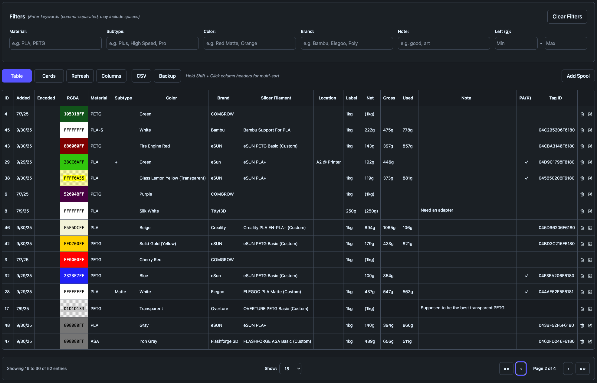
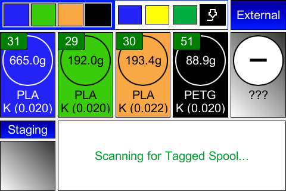
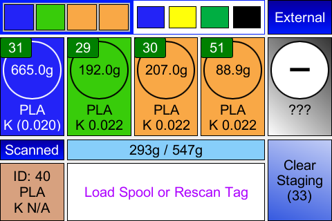
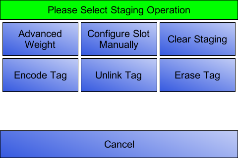
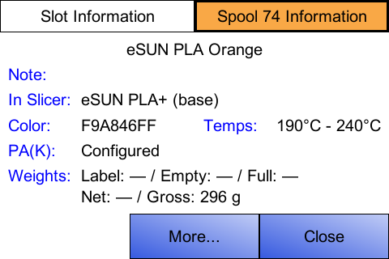
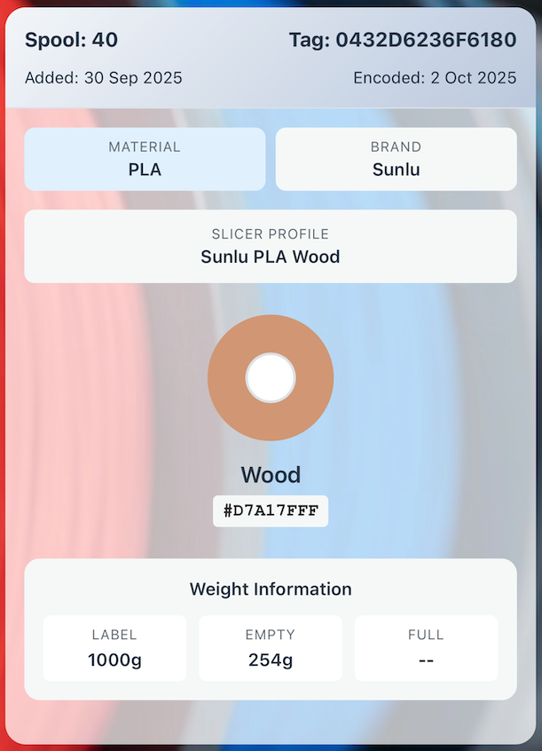
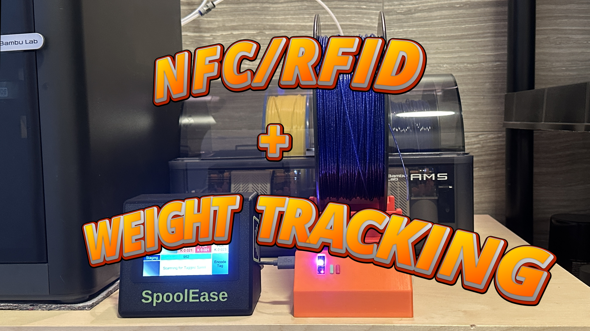

# SpoolEase System

> **This is a community fork of [yanshay/SpoolEase](https://github.com/yanshay/SpoolEase).**
> See [Differences from Upstream](#differences-from-upstream) for what this fork adds.

SpoolEase is a smart add-on system for Bambu Lab 3D printers that adds intelligence and control to every filament spool.

It features:
- NFC tags for automatic spool identification (see below supported tags and formats)
- Comprehensive spool inventory management system - keep your spools organized
- Precise dual method filament weight tracking using (1) weight scale, (2) print usage monitoring, combined with a very streamlined workflow - so you can tell how much filament is available in every spool
- Flexible storage system - with both structured and free-form locations, NFC location tags, streamlined and easy to use - so you can tell where each spool is at any given time
- Automatic slot configuration for material, color, pressure advance (K) - simplify printing and reduce errors
- Virtual Spool Label for viewing spool info on your mobile device
- Compatibility with your slicer filament settings
- Serves as backup for your pressure advance settings (for when the printer loses them — and yes, it happens)

- Supports most common NFC tags - NTAG (recommended 215 and above) and Mifare Classic (with Mifare no support yet for virtual label feature)
- Supports data import from and use of Bambu Lab filament RFID tags
- Supports Bambu Lab X1, P1, A1, H2, P2 product lines with AMS-Lite, AMS, AMS2-Pro and AMS-HT
- Supports multiple printers simultaneously (within resource limits)
- More ...

The system includes two products:  
- **SpoolEase Console** – The main hub with a display, managing inventory, weight tracking, AMS/External slot configuration, and showing AMS/External filament status. It works independently, but some features require SpoolEase Scale, so using both is recommended.
- **SpoolEase Scale** – Measures spool weight and feeds data to the Console. SpoolEase Scale depends on SpoolEase Console to operate.

SpoolEase works well together with the [SpoolEase NFC tag holder](https://makerworld.com/en/models/2050083) that supports easily swappable NFC tag, material type and spool-id labels for spool reuse purpose.

And most importantly, even though it’s an open-source project, it’s fun and easy to build and surprisingly simple to set up!

- [Documentation](https://docs.spoolease.io/docs/welcome)
- [Flashing Web Site](https://www.spoolease.io)
- [Translation Upload Page](https://mybesttools.github.io/SpoolEase/translations-upload.html)
- [Reddit](https://www.reddit.com/r/SpoolEase/)
- [Discord Server](https://discord.gg/6brKUCERcQ)

## Show Your Appreciation  
A **tremendous** amount of effort has gone into this project and continues to go in.  
If you find it valuable or helpful, please **Boost** the 3D models on MakerWorld and ⭐ **Star** the GitHub repo.

  

## Inventory Management (Press to Enlarge)

## A Few SpoolEase Console Screenshots
| While Printing (Weight Tracking in AMS) | Weighting Spool for Available  Filament|
|:--------:|:---------:|
|  |  |
| Spool Operations | Spool Information |
|  |  |

## Press Below for (outdated) Video Demonstration of SpoolEase Console  
**SpoolEase now offers far more features than shown in these videos! See the latest in the docs.**

  
  

## Press Below for Video Demonstration of SpoolEase Scale

  

---

**Notice:** This is a new project - while it has been installed by many happy users, new users should be aware that there are no warranties, liabilities, or guarantees, and they assume all risks involved.

## Collaboration

- For discussions, support and general discussions best to join SpoolEase [Discord Server](https://discord.gg/6brKUCERcQ)
- For questions, feedback, comments, etc. please use the [Repo discussions area](https://github.com/yanshay/SpoolEase/discussions)
- For getting notified on important updates, subscribe to the [Announcements Discussion](https://github.com/yanshay/SpoolEase/discussions/7)
- It would be real cool if you post your build in the [Introduce Your Build Discussion](https://github.com/yanshay/SpoolEase/discussions/8)

**I’d also greatly appreciate it if you could star SpoolEase GitHub repo.**

## Licensing Information

This project (including hardware designs, software, and case files) is freely available for you to build and use for any purpose, including within commercial environments. However, you may not profit from redistributing or commercializing the project itself. Specifically prohibited activities include:

- Selling assembled devices based on this project
- Selling kits or components packaged for this project
- Charging for the software or hardware designs
- Selling modified versions or derivatives
- Integrating the product, with or without modifications, into a commercial server offering, whether cloud-based or on-premise
- Offering paid installation, configuration, or support services specific to this project

To be clear: You CAN use this device in your business operations, even if those operations generate revenue. You CANNOT make money by selling, distributing, or providing services specifically related to this project or its components.

If you're interested in commercial licensing, redistribution rights, or other activities not permitted under these terms, please contact SpoolEase at gmail dot com for potential partnership opportunities.

## Detailed Instructions  

**Important:** Make Sure to Use Follow Docuemntation for Your Version.  

- **SpoolEase Console**  
  [Build](https://docs.spoolease.io/docs/build-setup/console-build)  
  [Setup](https://docs.spoolease.io/docs/build-setup/console-setup)  

- **SpoolEase Scale**  
  [Build](https://docs.spoolease.io/docs/build-setup/scale-build)  
  [Setup](https://docs.spoolease.io/docs/build-setup/scale-setup)

- **System Information**  
  [Usage](https://docs.spoolease.io/docs/quickstart/basic-usage-flows)  
  [Troubleshooting](https://docs.spoolease.io/docs/troubleshooting)

## Third Party Attributions
SpoolScale uses the following sources for it's Spools Catalog:  
- Scuk's "Empty Spool Weight Catalog": https://www.printables.com/model/464663-empty-spool-weight-catalog
- https://www.onlyspoolz.com/portfolio/

---

## Differences from Upstream

This fork ([mybesttools/SpoolEase](https://github.com/mybesttools/SpoolEase)) is based on [yanshay/SpoolEase](https://github.com/yanshay/SpoolEase) and extends it with the following changes.

### Multilingual UI, Config Page, and Web Inventory

The on-device UI (Slint), the web config page (`config.html`), and the web inventory are fully translated.
Supported languages: **English, German (de), French (fr), Dutch (nl), Polish (pl)**.

- Language selection persists in the browser and on the device.
- Translation strings are stored in `core/translations/<lang>.json` and embedded at build time via `core/translations.slint` and `build.rs`.
- The CSV inventory toolbar (export, column visibility, search) is translated in all languages.

### Translation Upload Page

A hosted GitHub Pages page at  
[`/SpoolEase/translations-upload.html`](https://mybesttools.github.io/SpoolEase/translations-upload.html)  
lets contributors submit a new language translation without needing to fork the repository.

- Authenticates via **GitHub Device Flow** (click a button, enter a code at `github.com/login/device` — no personal access token needed).
- After authentication, the user uploads a `.json` file; the worker validates it, commits it to a new branch, and opens a Pull Request automatically.
- Backed by a Cloudflare Worker (`workers/translation-oauth/`) that uses a bot token for all write operations; contributors need no repo access.

### GitHub Actions CI/CD — Flash-from-Browser

A GitHub Actions workflow (`.github/workflows/pages.yml`) builds the firmware on every push to `main` and deploys the result to GitHub Pages:

- Builds a merged flash image (`SpoolEase-flash.bin`) with `espflash save-image`.
- Stamps the version from `Cargo.toml` into `docs/firmware/manifest.json` (upgrade) and generates `manifest-new.json` (fresh install with Improv Wi-Fi).
- Deploys the full `docs/` folder to GitHub Pages, making firmware always available for flashing at [`docs/flash.html`](https://mybesttools.github.io/SpoolEase/flash.html).

### Inventory: Additional Spool Fields

Three new fields added to `SpoolRecord` and surfaced in the web inventory:

| Field | Description |
|---|---|
| `assigned_location` | The storage location a spool is assigned to |
| `actual_location` | Where the spool physically is right now |
| `spools_count` | Number of spools at this entry (defaults to 1 for backward compat) |

The inventory CSV renderer and column visibility controls are updated accordingly.

### Inventory and Config Page Bug Fixes

- Fixed inventory link and column padding for records from older database versions.
- Fixed JS compatibility for 0.6.1 firmware: appends the 3 new CSV columns so old DB records render without layout breakage.
- Fixed `SpoolRecord` to include all required fields in the Bambu API path (`bambu.rs`).

### Build and Deploy Improvements

- `deploy-vars.sh`: falls back to the Cargo git cache when the `deps/` submodule is absent (useful in CI).
- `deploy-beta.sh`, `deploy-debug.sh`, `deploy-rel.sh`: updated paths and flags for the 0.6.x toolchain.
- Added `deploy-shell-init.sh` for environment setup on the dev machine.
- Toolchain caching in CI keyed on `Cargo.lock` + `rust-toolchain.toml`.

### `rel="noopener noreferrer"` on External Links

All `target="_blank"` links in `docs/flash.html` and `docs/index.html` have `rel="noopener noreferrer"` added for security best practice.

## License

This software is licensed under Apache License, Version 2.0 **with Commons Clause** - see [LICENSE.md](LICENSE.md).

- ✅ Free for use
- ❌ Cannot be sold, offered as a service, or used for consulting, see [LICENSE.md](LICENSE.md) for more details
- 📧 For commercial licensing inquiries about restricted uses, contact: **SpoolEase at Gmail dot Com**

### Contribution Notice

Unless you explicitly state otherwise, any contribution intentionally submitted for inclusion in
the work by you, shall be licensed as above, without any additional terms or conditions.
